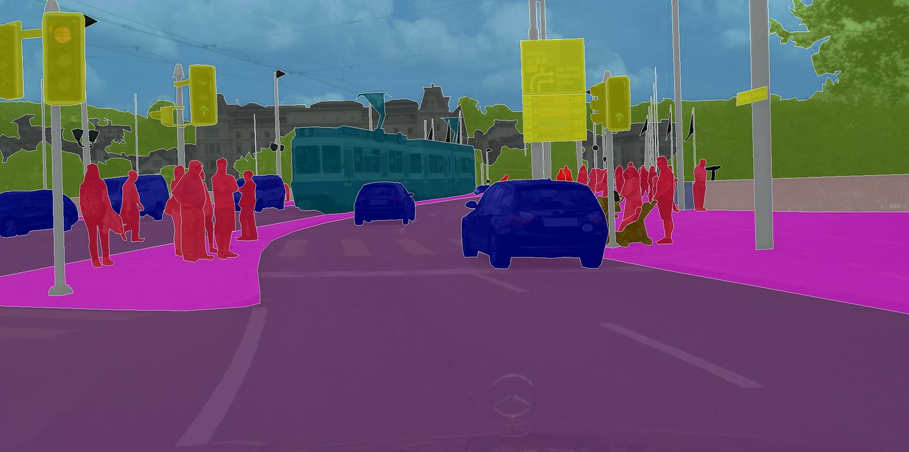
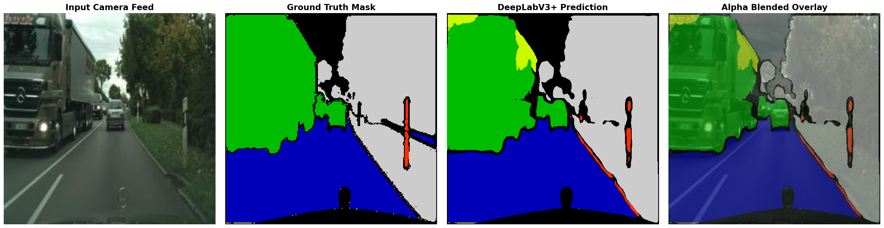
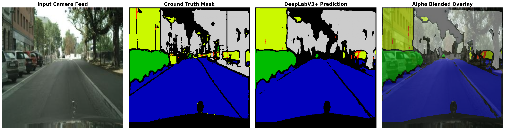

# 🏎️ AutoVision: Semantic Segmentation for Autonomous Driving

> **A deep learning pipeline for pixel-level urban scene understanding, evolving from a custom UNet baseline to an advanced DeepLabV3+ architecture fine-tuned on the Cityscapes dataset.**

[](#)
[](#)
[](#)
[](#)

---



## 📌 Project Overview

AutoVision is an ongoing research project focused on mastering **Semantic Segmentation** for self-driving vehicles. This repository documents the architectural evolution of a segmentation model, optimizing for real-world European driving sequences (e.g., Stuttgart).

- **Phase 1** established a robust PyTorch data pipeline and a custom deep-depth UNet baseline.
- **Phase 2** migrated to a DeepLabV3+ architecture with a ResNet50 backbone, focusing on optimizing inference for critical dynamic obstacles (vehicles and pedestrians) while overcoming data-loading bottlenecks.

---

## 🚀 Performance Metrics (Cityscapes Validation Set)

Models were evaluated on the Cityscapes validation set at 512x512 resolution.

### Phase 1: UNet Baseline Results

The initial fine-tuning focused on capturing critical "agent" classes.

| Category         | Foundation Score | Phase 1 Score | Change    |
| :--------------- | :--------------- | :------------ | :-------- |
| **Road**         | 88.29%           | **89.85%**    | ✅ +1.56% |
| **Vehicle**      | 66.10%           | **67.26%**    | ✅ +1.17% |
| **Construction** | 67.72%           | **69.46%**    | ✅ +1.74% |
| **Object**       | 17.91%           | **20.57%**    | ✅ +2.65% |
| **Nature**       | 75.59%           | **76.26%**    | ✅ +0.67% |

### Phase 2: DeepLabV3+ (ResNet50) Results

Phase 2 prioritized the most safety-critical dynamic elements in an autonomous driving context.

| Category         | Phase 1 (UNet) | Phase 2 (DeepLabV3+) | Architectural Impact        |
| :--------------- | :------------- | :------------------- | :-------------------------- |
| **Road**         | 90.73%         | **90.50%**           | Stable (Elite)              |
| **Vehicle**      | 69.47%         | **72.76%**           | 📈 **Massive Win (+3.29%)** |
| **Human**        | 21.03%         | **25.85%**           | 📈 **Massive Win (+4.82%)** |
| **Construction** | 72.60%         | **69.52%**           | Slight Drop                 |
| **Nature**       | 75.89%         | **71.25%**           | Slight Drop                 |
| **Object**       | 19.71%         | **16.70%**           | 📉 **Trade-off (-3.01%)**   |

### 🔬 Architectural Trade-Off Analysis

While the overall Mean IoU remained relatively stable (~58.9%), the DeepLabV3+ architecture fundamentally shifted the model's priorities:

- **The Dynamic Agent Win:** DeepLabV3+'s Atrous Spatial Pyramid Pooling (ASPP) proved vastly superior at capturing the distinct, variable shapes of dynamic obstacles (Vehicles and Humans), resulting in significant accuracy boosts for safety-critical targets.
- **The Static Object Trade-off:** The UNet's direct skip connections were highly effective at preserving fine, pixel-level details for thin static objects (like distant street poles). DeepLabV3+'s aggressive downsampling inside the ResNet50 backbone caused a drop in accuracy for these tiny pixel clusters, highlighting a classic trade-off between semantic depth and fine-grained boundary preservation.

---

## 🎨 Visual Results

_Below are alpha-blended overlays demonstrating the Phase 2 model's precision on complex urban scenes._


_(DeepLabV3+ isolating vehicles and pedestrians in high-density traffic)_


_(Confidence mapping and boundary detection on complex road networks)_

---

## 🛠️ Methodology & Pipeline Evolution

### 1. Data Processing

- **Phase 1 (Disk Baking):** Handled high-resolution image pairs by implementing a "mask baking" script to convert raw labels into 7-class semantic maps stored on disk.
- **Phase 2 (On-The-Fly Vectorization):** Rewrote the `CityscapesKaggleDataset` to utilize vectorized NumPy encoding, processing the 7-class color mapping dynamically in memory. Added ImageNet normalization (`mean=[0.485, 0.456, 0.406]`) to support pre-trained ResNet backbones.

### 2. Model Architectures

- **Phase 1 (Custom Deep UNet):** Built from scratch with dual 3x3 convolutions, BatchNorm2d, ReLU, and a 1024-channel bottleneck. Focused on skip-connection spatial preservation.
- **Phase 2 (DeepLabV3+):** Integrated a ResNet50 encoder. Utilized a **Weighted CrossEntropyLoss** function (`weights=[1.0, 0.8, 5.0, 2.0, 1.0, 15.0, 1.0]`) to aggressively penalize the model for missing highly underrepresented classes like Humans and Objects.

### 3. Hardware & Optimization

- Transitioned from dual Tesla T4s to a single **Tesla P100**.
- Identified and resolved a critical multi-GPU communication bottleneck (DataParallel GIL and CPU worker starvation), achieving a stable **~1.47 seconds per iteration** training speed on 512x512 tensors.

---

## 📦 Model Weights

Due to file size limits, model weights are hosted externally on Kaggle.

| Version | Architecture | Description | Access |
| :--- | :--- | :--- | :--- |
| **Phase 1** | Custom UNet | Baseline tuned on Cityscapes | [Download .pth File](https://www.kaggle.com/models/kaankoc0/cityscapes-fine-tuned-pth) |
| **Phase 2** | DeepLabV3+ | ResNet50 backbone, optimized for dynamic agents | [Download .pth File](https://www.kaggle.com/models/kaankoc0/deeplabv3-resnet50-best-pth) |
---

## 📂 Project Structure

```bash
autovision-cityscapes/
├── README.md
├── readme_images/
│   ├── segmentation_showcase_1.png
│   └── segmentation_showcase_2.png
├── src/
│   ├── __init__.py
│   ├── dataset.py
│   ├── model.py
│   └── models/
│       └── deeplab_v3.py
└── notebooks/
    ├── phase1_unet/
    │   ├── 01_cityscapes_training.ipynb
    │   └── 02_performance_evaluation.ipynb
    └── phase2_deeplabv3/
        ├── 01_deeplab_training_p100.ipynb
        └── 02_advanced_visualization.ipynb
```
